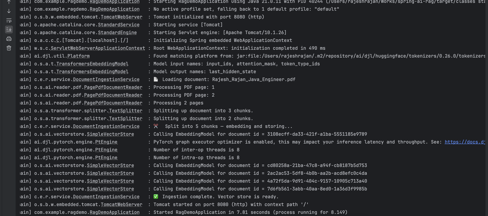

# Spring AI RAG Demo

A production-ready demonstration of **Retrieval-Augmented Generation (RAG)** built with Java 21 and Spring Boot 3. Ask natural language questions about any document — PDF or plain text — and get precise, grounded answers powered by a large language model. No hallucinations. No guesswork. Just answers anchored to your data.

This project uses **Groq** as the LLM provider (via its OpenAI-compatible API) and **OpenAI text-embedding-3-small** for document vectorisation, with Spring AI handling the entire RAG pipeline in clean, idiomatic Java.

---

## What Is RAG and Why Does It Matter?

Large Language Models are powerful — but they hallucinate. They confidently answer questions with fabricated facts drawn from their training data, with no grounding in reality.

**Retrieval-Augmented Generation solves this.** Instead of asking the model to invent an answer, you supply it with relevant context retrieved from your own documents. The model's only job is to synthesise that context into a clear response. The result is accurate, traceable, and grounded.

This is the technology behind enterprise chatbots, document Q&A systems, knowledge base search, and intelligent support tools. This project shows you how to build it from scratch in Java — no Python, no scripts, no external infrastructure.

---

## Live Demo

### Step 1 — Application Startup

On startup, Spring AI reads the document, splits it into chunks, generates embeddings, and loads everything into the in-memory vector store. The application is ready to accept queries only after ingestion completes.



---

### Step 2 — Ask a Question via curl

Send a natural language question to the REST API:

```bash
curl -X POST http://localhost:8080/ask \
  -H "Content-Type: application/json" \
  -d '{"question": "What is Rajesh Rajan total years of experience and his strongest technical skills?"}'
```


---

### Step 3 — Answer Grounded in the Document

The model answers directly from the ingested document — not from its general training data:


The response lists all 15 skill categories exactly as they appear in the source document, with no fabrication.

---

### Step 4 — Query About a Different Document

The same API works for any document. Here, querying about Spring AI concepts from the sample text file:

```bash
curl -X POST http://localhost:8080/ask \
  -H "Content-Type: application/json" \
  -d '{"question": "What is Spring AI and what are its key features?"}'
```


The model answers with Spring AI's exact feature list as described in the document — unified ChatClient, RAG support, vector database integrations — retrieved and grounded, not imagined.

---

### Step 5 — Getting a Groq API Key

This project uses Groq as the LLM provider. Groq offers a free tier with fast inference. Create your API key at [console.groq.com/keys](https://console.groq.com/keys):


---

## Architecture

```
┌─────────────────────────────────────────────────────────────────┐
│                        STARTUP (once)                           │
│                                                                 │
│  PDF / TXT  ──►  PagePdfDocumentReader  ──►  TokenTextSplitter  │
│                                                  │              │
│                                                  ▼              │
│                                          EmbeddingModel         │
│                                    (text-embedding-3-small)     │
│                                                  │              │
│                                                  ▼              │
│                                         SimpleVectorStore       │
│                                         (in-memory, JVM)        │
└─────────────────────────────────────────────────────────────────┘

┌─────────────────────────────────────────────────────────────────┐
│                   QUERY (per request)                           │
│                                                                 │
│  POST /ask  ──►  ChatController  ──►  RagService               │
│  {"question": "..."}                      │                     │
│                                           ▼                     │
│                               QuestionAnswerAdvisor             │
│                                 (intercepts the prompt)         │
│                                           │                     │
│                         ┌─────────────────┘                     │
│                         ▼                                       │
│                  Embed the question                             │
│                  Search vector store                            │
│                  Retrieve top-k chunks                          │
│                  Inject as context                              │
│                         │                                       │
│                         ▼                                       │
│              Groq LLM (llama-3.1-8b-instant)                   │
│                         │                                       │
│                         ▼                                       │
│              {"answer": "..."}  ──►  HTTP Response              │
└─────────────────────────────────────────────────────────────────┘
```

---

## Project Structure

```
spring-ai-rag/
│
├── src/main/java/com/example/ragdemo/
│   │
│   ├── RagDemoApplication.java              # Spring Boot entry point
│   │
│   ├── config/
│   │   └── VectorStoreConfig.java           # In-memory vector store bean
│   │
│   ├── controller/
│   │   └── ChatController.java              # POST /ask  |  GET /health
│   │
│   └── service/
│       ├── DocumentIngestionService.java    # Startup document pipeline
│       └── RagService.java                  # Core RAG query logic
│
├── src/main/resources/
│   ├── application.properties               # Config (API keys via env vars)
│   └── docs/
│       ├── sample.txt                       # Default sample document
│       └── Rajesh_Rajan_Java_Engineer.pdf   # Example PDF document
│
└── pom.xml                                  # Maven dependencies
```

---

## Class Reference

### `RagDemoApplication.java`

The Spring Boot entry point. Annotated with `@SpringBootApplication`, it bootstraps the entire application context. On startup, Spring initialises all beans in dependency order — `VectorStoreConfig` first, then `DocumentIngestionService` (which triggers document ingestion), then the REST layer.

---

### `VectorStoreConfig.java`

```java
@Configuration
public class VectorStoreConfig {
    @Bean
    public VectorStore vectorStore(EmbeddingModel embeddingModel) {
        return new SimpleVectorStore(embeddingModel);
    }
}
```

Registers a `SimpleVectorStore` as a Spring bean. All vectors live in JVM heap — no external database, no setup, no Docker required.

**To scale to production**, replace this single bean with `PgVectorStore`, `ChromaVectorStore`, `WeaviateVectorStore`, or `PineconeVectorStore`. The rest of the application does not change.

---

### `DocumentIngestionService.java`

```java
@Service
public class DocumentIngestionService {
    @PostConstruct
    public void ingestDocument() { ... }
}
```

Runs exactly once on startup via `@PostConstruct`. Three-stage pipeline:

**Stage 1 — Read:** Uses `PagePdfDocumentReader` to read a PDF from the classpath. Configurable via `rag.document.path`.

**Stage 2 — Chunk:** Uses `TokenTextSplitter` to split the document into chunks of approximately 500 tokens with 100-token overlap. The overlap ensures context is never lost at chunk boundaries.

**Stage 3 — Embed and Store:** Calls `vectorStore.add(chunks)`. Spring AI sends each chunk to `text-embedding-3-small`, receives a high-dimensional vector, and stores all vectors in the `SimpleVectorStore`. The vector store is ready before the application accepts any HTTP requests.

---

### `RagService.java`

```java
@Service
public class RagService {
    private final ChatClient chatClient;

    public RagService(ChatClient.Builder builder, VectorStore vectorStore) {
        this.chatClient = builder
            .defaultAdvisors(new QuestionAnswerAdvisor(vectorStore, SearchRequest.defaults()))
            .build();
    }

    public String ask(String question) { ... }
}
```

The heart of the application. The `QuestionAnswerAdvisor` intercepts every prompt and performs retrieval before the question reaches the LLM:

1. Embeds the incoming question
2. Performs cosine similarity search against the vector store
3. Retrieves the top-k most semantically similar document chunks
4. Injects those chunks into the prompt as a `CONTEXT` block
5. Forwards the enriched prompt to the LLM

The model answers from the context. If the answer is not in the context, it says so — no hallucination.

---

### `ChatController.java`

```java
@RestController
public class ChatController {
    @PostMapping("/ask")
    public ResponseEntity<Map<String, String>> ask(@RequestBody Map<String, String> body) { ... }

    @GetMapping("/health")
    public ResponseEntity<Map<String, String>> health() { ... }
}
```

A thin HTTP layer over `RagService`. Two endpoints:

**`POST /ask`** — accepts `{"question": "..."}`, validates it is non-empty, returns `{"question": "...", "answer": "..."}`.

**`GET /health`** — returns `{"status": "UP"}` for load balancer and monitoring probes.

---

---

## Sample Documents

The project ships with two ready-to-use documents in `src/main/resources/docs/`. Swap either one in via `application.properties` to see the RAG pipeline answer questions about completely different content.

---

### Document 1 — `sample.txt`

**Topic:** Java and Artificial Intelligence: A Production Perspective

A technical article covering the current state of Java in AI engineering — Spring AI, RAG, LangChain4j, and Deep Java Library (DJL). This is the default document for general Spring AI queries.

**Content:**

```
Java and Artificial Intelligence: A Production Perspective

Introduction
------------
Java has long been the backbone of enterprise software systems. In recent
years, it has also emerged as a serious platform for deploying and integrating
artificial intelligence. While Python dominates model training and
experimentation, Java is increasingly the language of choice when AI meets
production.

Spring AI
---------
Spring AI is an application framework from the Spring team that brings AI
capabilities to Java applications using familiar Spring patterns. It provides
abstractions over large language models (LLMs), vector stores, and embedding
models, allowing developers to swap providers without rewriting business logic.

Key features of Spring AI include:
- A unified ChatClient API that works with OpenAI, Azure OpenAI, Anthropic,
  Ollama, and others
- Built-in support for Retrieval-Augmented Generation (RAG) via advisors
- Integration with vector databases including pgvector, Chroma, Weaviate,
  and Pinecone
- Document readers for PDF, plain text, and JSON sources
- TokenTextSplitter for chunking large documents before embedding

Retrieval-Augmented Generation (RAG)
-------------------------------------
RAG is a technique that grounds LLM responses in a specific knowledge base,
preventing hallucination. The process works as follows:
1. Documents are split into chunks and converted to vector embeddings
2. Embeddings are stored in a vector database
3. When a user asks a question, it is also embedded
4. The most semantically similar chunks are retrieved
5. Those chunks are injected into the LLM prompt as context
6. The LLM answers using the provided context rather than relying on
   general training data

LangChain4j
-----------
LangChain4j is another Java framework inspired by Python's LangChain. It
offers a fluent API for building LLM chains, tools, and agents.

Deep Java Library (DJL)
------------------------
DJL, developed by AWS, allows Java developers to run pre-trained deep
learning models directly on the JVM — supporting PyTorch, TensorFlow,
and MXNet backends.

Why Java for AI in Production?
-------------------------------
- Maturity: decades of tooling for monitoring, deployment, and security
- Performance: JVM JIT compilation and GC tuning at scale
- Integration: AI added directly into existing Spring Boot microservices
- Talent: Java developers outnumber Python engineers in many enterprises
- Type safety: strong typing catches errors at compile time

Conclusion
----------
With Spring AI and LangChain4j, Java applications can embed sophisticated
AI behaviour — RAG pipelines, chatbots, and autonomous agents — using the
same patterns and deployment infrastructure that teams already know.
```

**Example query:**
```bash
curl -X POST http://localhost:8080/ask \
  -H "Content-Type: application/json" \
  -d '{"question": "What is Spring AI and what are its key features?"}'
```


---

### Document 2 — `Rajesh_Rajan_Java_Engineer.pdf`

**Topic:** Senior Java Engineer CV / Resume (PDF)

A real-world structured PDF document used to demonstrate the RAG pipeline's ability to extract specific facts — years of experience, technical skills, certifications, employment history — with high precision from a PDF source.

**Example query:**
```bash
curl -X POST http://localhost:8080/ask \
  -H "Content-Type: application/json" \
  -d '{"question": "What is Rajesh Rajan total years of experience and his strongest technical skills?"}'
```


The model returns all 15 skill categories exactly as they appear in the CV — retrieved from the document, not invented from training data.

---

### Using Your Own Document

1. Place your file in `src/main/resources/docs/`
2. Update `application.properties`:
   ```properties
   # For a PDF
   rag.document.path=docs/your-document.pdf

   # For plain text
   rag.document.path=docs/your-document.txt
   ```
3. Restart the application — ingestion runs automatically on startup

Supported formats: **PDF** (via `PagePdfDocumentReader`) and **plain text** (via `TextReader`).

---

## Tech Stack

| Technology | Version | Purpose |
|---|---|---|
| Java | 21 | Language |
| Spring Boot | 3.3.2 | Application framework |
| Spring AI | 1.0.0-M1 | LLM + RAG abstraction layer |
| Groq (llama-3.1-8b-instant) | — | Chat LLM via OpenAI-compatible API |
| OpenAI (text-embedding-3-small) | — | Document and query embeddings |
| SimpleVectorStore | — | In-memory vector storage |
| Maven | — | Build tool |

---

## Getting Started

### Prerequisites

- Java 21+
- Maven 3.8+
- A **Groq API key** — free tier at [console.groq.com](https://console.groq.com)
- An **OpenAI API key** — for `text-embedding-3-small` embeddings (used for document embedding only)

### 1. Clone the repository

```bash
git clone https://github.com/rajesh-rajan-dev/spring-ai-rag.git
cd spring-ai-rag
```

### 2. Set your API key

Open `application.properties` and replace the placeholder with your real Groq API key:

```properties
# ─────────────────────────────────────────────
#  Spring AI RAG Demo — application.properties
# ─────────────────────────────────────────────

spring.ai.openai.api-key=GENERATED_GROQ_API_KEY_HERE   ← replace this
spring.ai.openai.base-url=https://api.groq.com/openai
spring.ai.openai.chat.options.model=llama-3.1-8b-instant
spring.ai.openai.chat.options.temperature=0.3

rag.document.path=docs/Rajesh_Rajan_Java_Engineer.pdf

# Embedding model (used to vectorise document chunks)
spring.ai.openai.embedding.options.model=text-embedding-3-small

# Server port
server.port=8080

# Logging — set to DEBUG to see RAG context being injected
logging.level.org.springframework.ai=INFO
```

Get your free Groq API key at [console.groq.com/keys](https://console.groq.com/keys). The OpenAI embedding model (`text-embedding-3-small`) also requires an OpenAI API key — set `spring.ai.openai.api-key` to your OpenAI key if you want to use OpenAI for embeddings, or configure a local embedding model.

### 3. Choose your document

The default document is `docs/Rajesh_Rajan_Java_Engineer.pdf`. To switch to the sample text file or your own document, update `application.properties`:

```properties
# Use the included sample text
rag.document.path=docs/sample.txt

# Or your own document
rag.document.path=docs/your-document.pdf
```

### 4. Add your document

Place your PDF or text file in `src/main/resources/docs/` and update `rag.document.path`.

### 5. Build and run

```bash
mvn clean install
mvn spring-boot:run
```

### 6. Ask a question

```bash
curl -X POST http://localhost:8080/ask \
  -H "Content-Type: application/json" \
  -d '{"question": "Summarise the key points of this document"}'
```

### 7. Health check

```bash
curl http://localhost:8080/health
```

---

## Configuration Reference

| Property | Description |
|---|---|
| `spring.ai.openai.api-key` | API key (Groq or OpenAI) |
| `spring.ai.openai.base-url` | Override for Groq: `https://api.groq.com/openai` |
| `spring.ai.openai.chat.options.model` | LLM model name |
| `spring.ai.openai.chat.options.temperature` | Response creativity (0.0–1.0) |
| `spring.ai.openai.embedding.options.model` | Embedding model |
| `rag.document.path` | Classpath path to the document |
| `server.port` | HTTP server port |
| `logging.level.org.springframework.ai` | Set DEBUG to see RAG context injection |

---

## Author

**Rajesh Rajan**
Senior Java Backend Engineer | Stockholm, Sweden
[LinkedIn](https://www.linkedin.com/in/rajesh-rajan-358247100/) | [GitHub](https://github.com/rajesh-rajan-dev)

---

*Part of a portfolio demonstrating Java backend, cloud architecture, and AI integration capabilities.*
